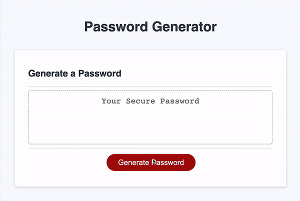

# Password Generator

## Deployed Website

[Password Generator](https://yeezyhub.github.io/Password-Generator/)

## Description

&nbsp;&nbsp;&nbsp;&nbsp;&nbsp;&nbsp;People use almost same passwords everywhere and that makes us a target for hacking activities. Therefore we need stronger and unique passwords for every other login credentials to prevent hacking activities. Because of that reason, I have created a password generator that can solve creating random passwords, it is couple clicks away! Also, during the project I've learned how to use JavaScript functions with the help of some DOM elements.

## Usage
&nbsp;&nbsp;&nbsp;&nbsp;&nbsp;&nbsp;To generate a password, click on "Generate Password" button. Then the page will ask you how long you want your password to be. After choosing that the prompts for choosing special, numeric, lower case and upper case will show up for you to choose. After the last question, the generated customized and secure password will be shown on the website inside the textbox so you can copy and paste it to store it.

## Credits

My Github Profile: [yeezyhub](https://github.com/yeezyhub)

## License

Please refer to the LICENSE in the repo.
